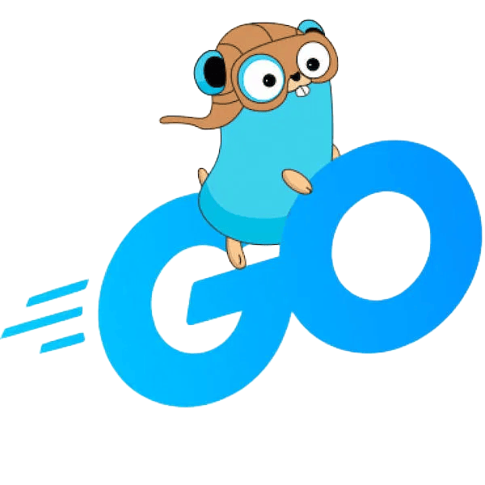

<h1 align="center">Wells Go Framework</h1>

  
  

  <strong>Wells Go</strong> is a lightweight scaffolding tool for generating modular Go backend projects with <b>Clean Architecture</b> principles.  
  Save time, enforce structure, and start coding your business logic right away!

<!-- Added image -->

  

<h2>📌 Table of Contents</h2>
<ul>
  <li><a href="#about-the-project">About The Project</a></li>
  <li><a href="#features">Features</a></li>
  <li><a href="#project-structure">Generated Project Structure</a></li>
  <li><a href="#installation">Installation</a></li>
  <li><a href="#usage">Usage</a></li>
  <li><a href="#cli-commands">CLI Commands</a></li>
  <li><a href="#example-crud">Example CRUD (User)</a></li>
  <li><a href="#configuration">Configuration</a></li>
  <li><a href="#testing">Testing</a></li>
  <li><a href="#development-workflow">Development Workflow</a></li>
  <li><a href="#contributing">Contributing</a></li>
  <li><a href="#license">License</a></li>
</ul>

<h2 id="about-the-project">ℹ️ About The Project</h2>

  <b>Wells Go</b> helps Go developers kickstart projects with a clean and modular foundation.  
  Instead of manually setting up boilerplate, Wells Go generates a ready-to-use structure following Domain-Driven Design (DDD) and Clean Architecture.

<h2 id="features">🚀 Features</h2>
<ul>
  <li>Generate Go project structure instantly</li>
  <li>Opinionated <b>Clean Architecture + DDD</b> folder layout</li>
  <li>Built-in support for DTOs, Mappers, Services, and Repositories</li>
  <li>Includes working example <b>CRUD API</b></li>
  <li>Test-ready scaffolding (unit + integration)</li>
  <li>CLI commands for code generation and runtime execution</li>
</ul>

<h2 id="project-structure">🗂️ Generated Project Structure</h2>
<pre>
myapp/
├── cmd/                # Entry points (api, worker, etc.)
├── application/        # Usecases, DTOs, mappers
├── domain/             # Entities, repository interfaces
├── infrastructure/     # Database, Redis, persistence, config
├── interfaces/http/    # HTTP handlers, routes
├── pkg/response/       # Response helpers (JSON, paging, error)
├── go.mod              # Go modules
├── app.env             # Environment configuration
</pre>

<h2 id="installation">🛠️ Installation</h2>
<h3>Prerequisites</h3>
<ul>
  <li>Go 1.18 or higher</li>
  <li>Git</li>
</ul>

<h3>Install Wells CLI</h3>
<pre><code>go install github.com/welliardiansyah/wells-cli@latest
</code></pre>

Make sure your <code>$GOPATH/bin</code> is in your <code>PATH</code>:

<pre><code>export PATH=$PATH:$(go env GOPATH)/bin
</code></pre>

<h2 id="usage">⚡ Usage</h2>

To scaffold a new Go project:

<pre><code>wells-cli new myapp
cd myapp
go mod tidy
</code></pre>

Run the project:
 
<ul>
  
Run HTTP server

  <li><pre><code>wells-cli run api</code></pre></li>
  
Run worker process

  <li><pre><code>wells-cli worker</code></pre></li>
</ul>
<!-- <pre>code>wells-cli run api → Run HTTP server (HTTPS)</pre> <pre><code>wells-cli worker</code> → Run worker process</pre> -->

<h2 id="cli-commands">💻 CLI Commands</h2>
<h3>Code Generation Commands</h3>
<ul>
  <li><code>wells-cli model NAME</code> → Creates a model/entity</li>
  <li><code>wells-cli migration-postgres NAME</code> → Creates a PostgreSQL migration file</li>
  <li><code>wells-cli inbound-http-fiber NAME</code> → Generates HTTP handlers using Fiber</li>
  <li><code>wells-cli inbound-message-rabbitmq NAME</code> → Creates RabbitMQ message consumers</li>
  <li><code>wells-cli inbound-command NAME</code> → Creates CLI command handlers</li>
  <li><code>wells-cli outbound-database-postgres NAME</code> → Creates PostgreSQL database adapter</li>
  <li><code>wells-cli outbound-http NAME</code> → Creates HTTP client adapter</li>
  <li><code>wells-cli outbound-message-rabbitmq NAME</code> → Creates RabbitMQ message adapter</li>
  <li><code>wells-cli outbound-cache-redis NAME</code> → Creates Redis cache adapter</li>
  <li><code>wells-cli generate-mocks</code> → Generates mock implementations from go:generate directives</li>
</ul>

<h3>Runtime Commands</h3>
<ul>
  <li><code>wells-cli run</code> → Runs the project (HTTP server by default)</li>
  <li><code>wells-cli http</code> → Runs project in HTTP server mode</li>
  <li><code>wells-cli message SUBSCRIBER</code> → Runs message consumer</li>
  <li><code>wells-cli command CMD NAME</code> → Executes specific CLI command</li>
</ul>

<h2 id="example-crud">📝 Example CRUD</h2>

Wells Go generates a working CRUD for <code>User</code>:

<ul>
  <li><code>GET /users</code> → List users</li>
  <li><code>POST /users</code> → Create new user</li>
  <li><code>GET /users/:id</code> → Get user by ID</li>
  <li><code>PUT /users/:id</code> → Update user</li>
  <li><code>DELETE /users/:id</code> → Delete user</li>
</ul>

Example request:

<pre><code>curl -X POST http://localhost:8080/users \
  -H "Content-Type: application/json" \
  -d '{"name":"John Doe","email":"john@example.com"}'
</code></pre>

<h2 id="testing">🧪 Testing</h2>

Run all tests:

<pre><code>go test ./...
</code></pre>

Generate coverage report:

<pre><code>go test -coverprofile=coverage.profile -cover ./...
go tool cover -html=coverage.profile -o coverage.html
</code></pre>

<h2 id="development-workflow">🛠 Development Workflow</h2>

Step-by-step workflow with Wells CLI:

<ol>
  <li><strong>Create Models:</strong> <code>wells-cli model product</code></li>
  <li><strong>Create Database Migrations:</strong> <code>wells-cli migration-postgres product</code></li>
  <li><strong>Implement Domain Logic:</strong> Add business logic in <code>domain/</code> and <code>application/usecases/</code></li>
  <li><strong>Create Inbound Adapters:</strong>
    <ul>
      <li><code>wells-cli inbound-http-fiber product</code></li>
      <li><code>wells-cli inbound-message-rabbitmq product</code></li>
      <li><code>wells-cli inbound-command product</code></li>
    </ul>
  </li>
  <li><strong>Create Outbound Adapters:</strong>
    <ul>
      <li><code>wells-cli outbound-database-postgres product</code></li>
      <li><code>wells-cli outbound-http product_api</code></li>
      <li><code>wells-cli outbound-cache-redis product</code></li>
      <li><code>wells-cli outbound-message-rabbitmq product</code></li>
    </ul>
  </li>
  <li><strong>Write Tests and Generate Mocks:</strong> <code>wells-cli generate-mocks</code></li>
  <li><strong>Run the Application:</strong>
    <ul>
      <li><code>wells-cli http</code> → Run HTTP server</li>
      <li><code>wells-cli message consumer</code> → Run message consumer</li>
      <li><code>wells-cli command CMD name</code> → Run specific command</li>
    </ul>
  </li>
</ol>

<h2 id="contributing">🤝 Contributing</h2>

Contributions are welcome! Fork this repo, create a feature branch, and submit a pull request.

<h2 id="license">📄 License</h2>

MIT License - see <a href="https://github.com/welliardiansyah/wells-cli/blob/master/LICENSE.md">LICENSE</a> for details.

